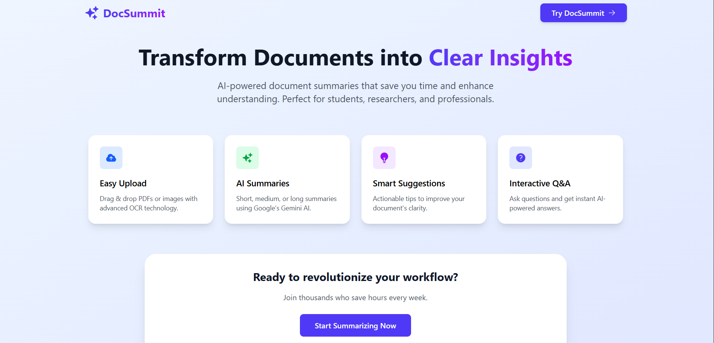

# 🚀 DocSummit - AI Document Summarization Tool  

DocSummit is an intelligent document assistant that transforms your lengthy documents into clear, concise summaries using advanced AI.  
Perfect for **students, researchers, and professionals** who need to quickly understand complex materials.  

                                    Live Link 

-> https://docsummit.vercel.app/

                                    GitHub Link

-> https://github.com/DhimanMajumdar/DocSummit--An-AI-SaaS-document-summarizer

                                    Images

             

---

## ✨ Features  

- 📄 **Smart Document Processing**: Extract text from PDFs and images with advanced OCR  
- 🤖 **AI-Powered Summaries**: Choose from three summary lengths to match your needs  
- 💡 **Improvement Suggestions**: Get actionable tips to enhance your document's clarity  
- ❓ **Interactive Q&A Session**: Ask questions directly from your document and get AI-powered answers instantly  
- 🎨 **Beautiful Interface**: Clean, modern design that's easy and enjoyable to use  
- ⚡ **Instant Results**: Real-time processing with immediate feedback  
- 🔒 **Privacy First**: Your documents are processed in your browser for maximum security  

---

## 🚀 How It Works  

1️⃣ **Upload Your Document**  
- Simply drag and drop your PDF or image file into the upload zone.  
- We support **PDFs, PNG, JPG**, and other common formats.  

2️⃣ **Automatic Text Extraction**  
- `pdf.js` → Digital PDFs  
- `Tesseract.js` → Scanned documents & images  

3️⃣ **AI Magic Happens**  
Google's Gemini AI analyzes your content and generates:  
- **Short Summary (3 sentences)** → Quick overview  
- **Medium Summary (5-7 sentences)** → Balanced detail  
- **Long Summary (10-12 sentences)** → Comprehensive understanding  

4️⃣ **Get Smart Suggestions**  
- Receive AI-powered recommendations to improve your document's structure, clarity, and readability.  

5️⃣ **Ask Questions with Q&A Box**  
- Don’t just summarize—**interact with your document**.  
- Ask **any question** about your uploaded file, and the AI responds with **context-aware answers**.  

6️⃣ **You're Done!**  
- Copy, download, or use your summaries instantly.  

---

## 🛠️ Tech Stack  

- **Frontend**: React + Vite  
- **Styling**: Tailwind CSS  
- **PDF Processing**: pdf.js  
- **OCR**: Tesseract.js  
- **AI API**: Google Gemini  
- **Build Tool**: Vite  

---

## 🚀 Approach & Technical Implementation  

### 🔹 Development Philosophy  
I built DocSummit with a clear vision: create an **intuitive document summarization tool** that feels magical yet remains technically robust.  
The goal was to **balance powerful AI capabilities with seamless UX**, ensuring even non-technical users benefit from advanced document processing.  

---

### 🔹 Technical Flow & Architecture  

**Step 1: Client-Side Processing**  
- File processing handled in-browser using **pdf.js** and **Tesseract.js**.  
- Ensures **privacy** → documents stay on the device until text extraction is complete.  

**Step 2: Intelligent AI Integration**  
- Only **extracted text** is sent to **Google's Gemini API**.  
- Implemented **smart caching** to avoid redundant API calls → faster & cost-efficient.  

**Step 3: Responsive UI Architecture**  
- Built with **React + Tailwind** for a modern, responsive design.  
- Includes **Summary Tabs** (short/medium/long) and a **Q&A Box** for real-time interaction.  

**Step 4: Error Resilience**  
- Comprehensive error handling → from file validation to API failures.  
- Provides **graceful fallback messages** instead of crashes.  

---

🔥 **Application Flow** mirrors natural document usage:  

->>> Upload → Extract → Summarize → Ask → Refine
     This progression makes **advanced AI tech accessible**, while keeping the experience smooth & reliable.  

## 📄 License  

MIT License © 2025  
Built with ❤️ by Dhiman Majumdar       

